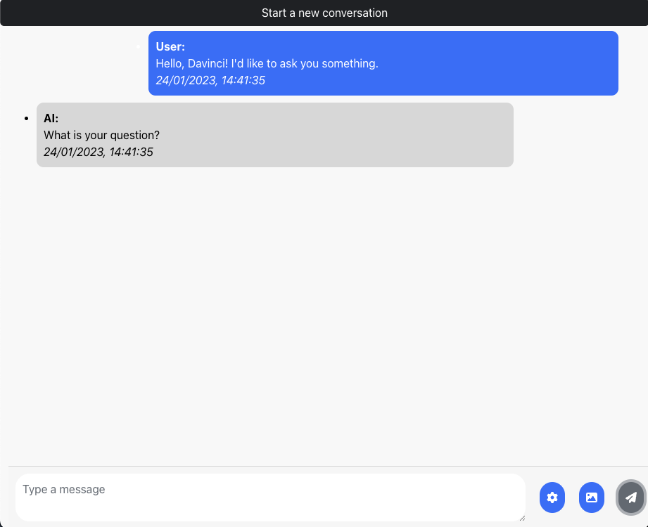

# OpenAI Chat Window

This is a playground which you can use to play with OpenAI's Text Completion Models (and to some extent with DALL-E as well).

The app is similar in functionality to the public ChatGPT-3 offered by OpenAI but configured to use OpenAI's other GPT models, such as Davinci, Ada or Currie.
You can chose which model to use in the Settings window, as well as certain parameters (which have a description snippet from the official documentation when you hover the mouse over them). As I'm not a design person at all, the design is somewhat inspired by Apple's iOS Messages app, to which I own no copyright to, nor I intend to sell as my own in any way.

The app is not meant for a public release, but rather as a test playground to play around with those models.

In order to work, you have to [generate an API key from OpenAI](https://beta.openai.com/account/api-keys) and put it in the Settings window (at API Key). 

This project was made using React. (And was bootstrapped with [Create React App](https://github.com/facebook/create-react-app)).

## Installation & Running the app

In the project directory, you can run:

### 1. Install yarn in case you don't already have it - [Yarn Installation](https://classic.yarnpkg.com/lang/en/docs/install)

### 2. Run `yarn install` to install all dependencies

### 3. Run `yarn start`

Runs the app in the development mode.\
Open [http://localhost:3000](http://localhost:3000) to view it in your browser.

## Important Notes

1. Be careful of your token usage. In order to continue the conversation with the AI model you chose, all your previous messages will count towards the token usage, so the longer the conversation, the higher the token usage. If you would like to rather ask him something new, where the conversation history does not matter, I highly recommend to use the 'Start new conversation' button at the top.
2. The initial prompt includes behind the scene a message to pre-train the AI's answers. This has been proven to be quite useful in my experiences, but adds to the token usage a very little. You can disable this form the Settings menu - Initial Prompt checkbox or change the text there entirely as well, but if you choose to change it, and include a conversation, try to keep the "User" and "AI" tags.